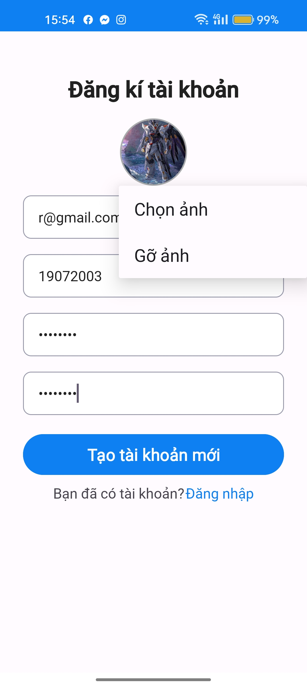
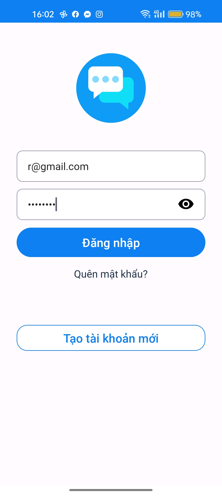
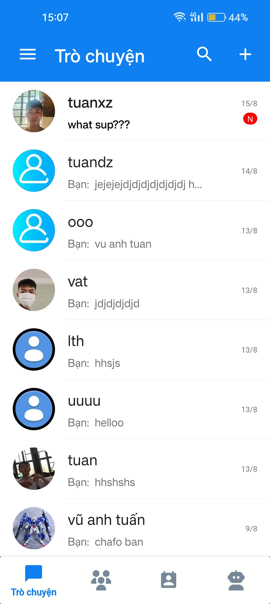
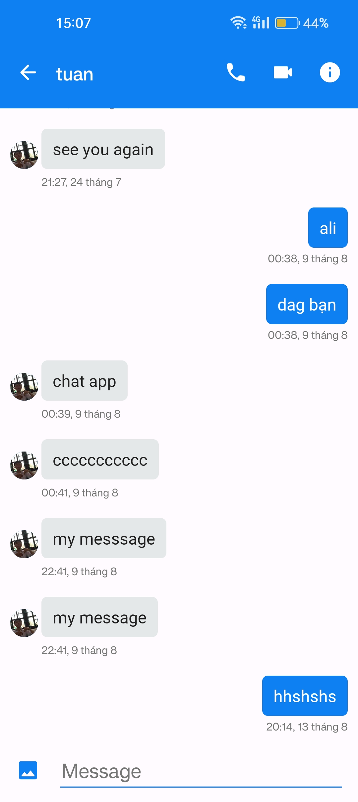
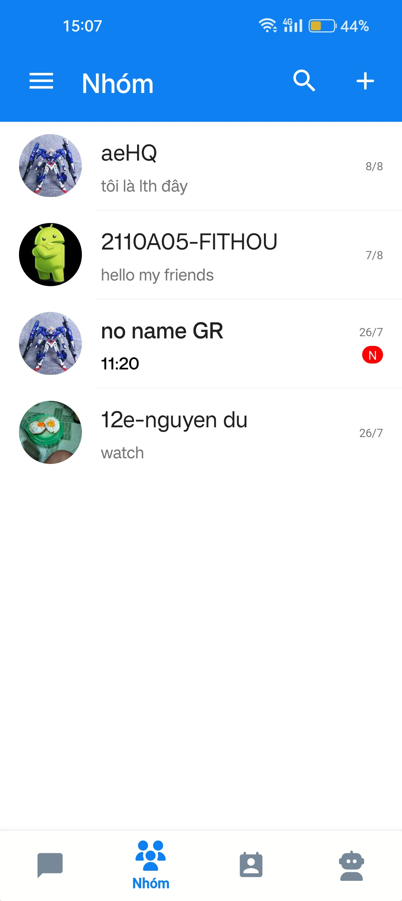
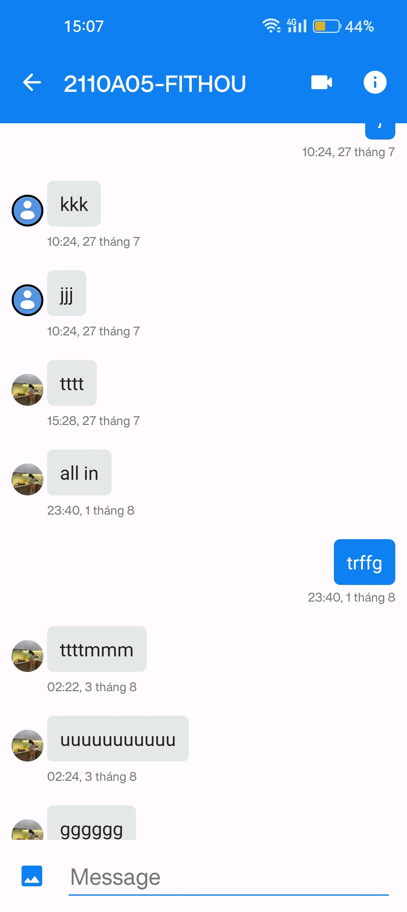
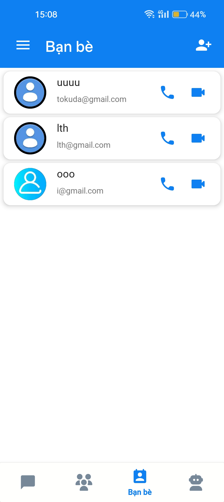

<!DOCTYPE html>
<html lang="en">
  <head>
    <meta charset="UTF-8" />
    <meta name="viewport" content="width=device-width, initial-scale=1.0" />
    </style>
  </head>
  <body>
    <h1>Chat App</h1>
    <h2>@author Vu Anh Tuan</h2>
    <h3>Giao diện</h3>
    <ul>
      <li>
        Đăng kí  
      </li>
      <li>
        Đăng nhập  
      </li>
      <li>
        Danh sách trò chuyện  
      </li>
      <li>
        Nhắn tin  
      </li>
      <li>
        Danh sách trò chuyện nhóm  
      </li>
      <li>
        Nhắn tin nhóm  
      </li>
      <li>
        Danh sách bạn bè  
      </li>
    </ul>
  </body>
</html>
